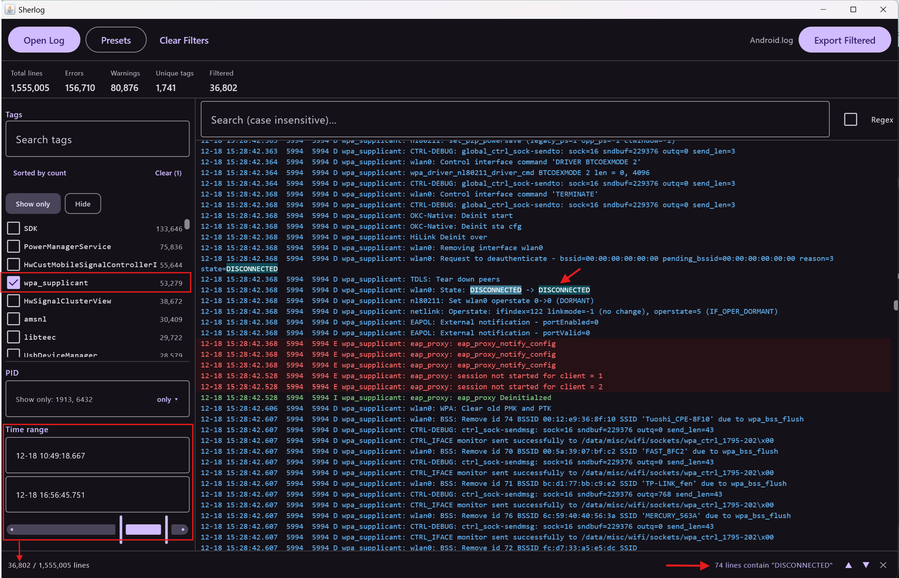

# Sherlog

Desktop GUI tool (Kotlin + Compose Desktop) for analyzing and cleaning large
Android logcat files — a replacement for manual `findstr`/regex log cleanup.



A 1,555,005-line dump narrowed to **36,802 lines** by one tag and a time range,
with every occurrence of the selected text highlighted and counted
(*74 lines contain "DISCONNECTED"*, bottom right) so you can step through them.

Docs: [User Guide](docs/USER_GUIDE.md) · [Features](docs/FEATURES.md) ·
[Why this tool](docs/WHY_THIS_TOOL.md).

## Features (MVP)

- Open `.txt` / `.log` logcat dumps of any size (1GB+); the file is **indexed,
  never loaded into memory** — line text is read from disk on demand.
- Parses threadtime format: timestamp, PID, TID, level, tag.
- Dashboard: total lines, errors, warnings, unique tags, filtered count.
- Top-tags list with counts, sortable by count or A–Z, searchable, with
  checkbox include-filtering.
- Filters: tags, PIDs, time range (`MM-DD HH:MM:SS`), levels,
  exclude-substrings, keep-substrings. All combinable.
- Search: case-insensitive, optional regex, highlighted matches, match count.
- Debug presets: Network / Crash / Video.
- Export the filtered view to a new `.txt`/`.log` file (streaming).
- All heavy work runs on background coroutines with progress + cancel.

## Roadmap

Planned, roughly in priority order. Contributions welcome — open an issue
before starting anything large.

- [ ] **Multiple files open at once** — tabs or split panes, so several dumps can be compared
      without reopening. Each tab keeps its own index and filter state.
- [ ] **Save the current filter set as a preset** — name and store whatever is
      configured (tags, PIDs, levels, time range, exclude/keep text) alongside
      the built-in Network / Crash / Video presets, and edit or delete them
      later.
- [ ] **Persist presets to disk** — so custom presets survive a restart and can
      be shared with a teammate as a file.
- [ ] **Session restore** — reopen the last file with its filters intact.

## Architecture

```
parser/   LogcatLineParser      hand-rolled threadtime parser (no regex, hot path)
core/     LogIndexer            one streaming pass -> LogIndex
          LogIndex              per-line metadata in primitive arrays (~25 B/line)
          LineTextProvider      on-demand line text via 64KB block LRU cache
filter/   FilterState/Engine    metadata filters answered from the index (instant);
                                text filters stream the file once, cancellable
          Presets               Network / Crash / Video profiles
export/   LogExporter           streams selected lines to the output file
ui/       Compose Desktop UI    AppState + App/FilterPanel/LogViewer
```

Timestamps have no year in logcat, so they are stored as millis relative to a
fixed leap reference year (02-29 always parses). Lines that don't match the
threadtime format (buffer markers, raw stack-trace dumps) are kept with level
`UNKNOWN` / no tag; the "Other" level checkbox controls them.

## Run

```
.\gradlew.bat run
```

## Test

```
.\gradlew.bat test
```

## Package (Windows installer)

```
.\gradlew.bat packageMsi
```

Requires JDK 17+.

## License

Released under the [MIT License](LICENSE) — free to use, modify, and
distribute. Contributions welcome.
